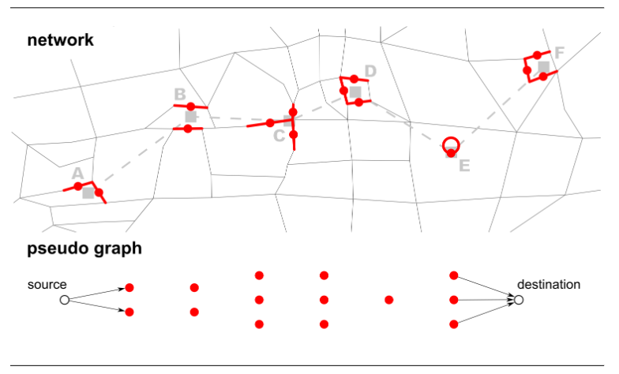
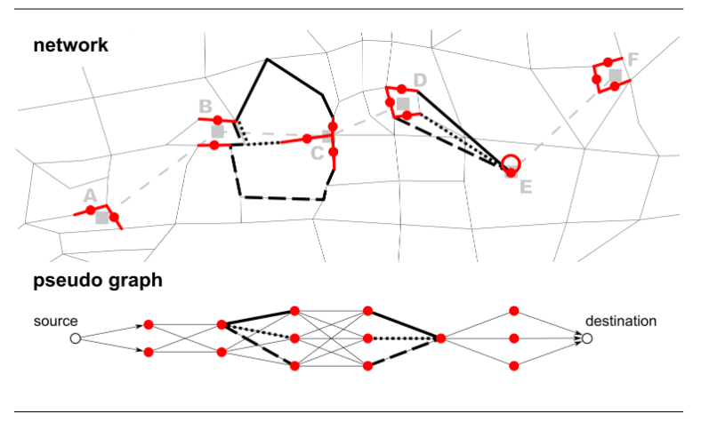

# Etap 1/2

## Opis danych w OSM

Dane dotyczące przystanków autobusowych zapisane są w plikach `*.osm` w postaci znaczników `node` z tagami: `<tag k="bus" v="yes"/>`, `<tag k="public_transport" v="platform"/>` oraz `<tag k="highway" v="bus_stop"/>`. Przykładowy fragment pliku `*.osm`:

```xml
<node id="1701717675" visible="true" version="11" changeset="108577455" timestamp="2021-07-25T19:02:54Z" user="duran_defrost" uid="13478299" lat="51.1178972" lon="17.0310065">
  <tag k="bench" v="yes"/>
  <tag k="bin" v="yes"/>
  <tag k="bus" v="yes"/>
  <tag k="departures_board" v="realtime"/>
  <tag k="highway" v="bus_stop"/>
  <tag k="name" v="Pomorska"/>
  <tag k="network" v="Wrocław"/>
  <tag k="operator" v="ZDiUM Wrocław"/>
  <tag k="public_transport" v="platform"/>
  <tag k="ref" v="10655"/>
  <tag k="shelter" v="yes"/>
  <tag k="tactile_paving" v="no"/>
  <tag k="tram" v="yes"/>
 </node>
```

oraz

```xml
 <node id="302864607" visible="true" version="11" changeset="77276819" timestamp="2019-11-19T13:42:00Z" user="maro21" uid="3476229" lat="51.1136078" lon="17.0322370">
  <tag k="name" v="Uniwersytet Wrocławski"/>
  <tag k="old_name" v="Uniwersytet"/>
  <tag k="public_transport" v="stop_position"/>
  <tag k="railway" v="tram_stop"/>
  <tag k="ref" v="10015"/>
  <tag k="tram" v="yes"/>
 </node>
```

a w przypadku nieużywanych

```xml
 <node id="304085780" visible="true" version="10" changeset="81903508" timestamp="2020-03-07T16:24:48Z" user="Paweł Bogubowicz" uid="7708037" lat="51.1172015" lon="17.0317912">
  <tag k="disused:public_transport" v="stop_position"/>
  <tag k="disused:railway" v="tram_stop"/>
  <tag k="name" v="Pomorska"/>
  <tag k="note" v="Przystanek nieczynny ze względu remont mostów Pomorskich"/>
  <tag k="ref" v="10602"/>
  <tag k="tram" v="yes"/>
 </node>
```

Opis w dokumentacji OSM informuje nas, że

### Buses and trams

Bus stops along the route should be tagged with `highway=bus_stop`
or using the newer `public_transport=platform`,
which should be positioned to the side of the carriageway where passengers wait.

A tram running within the main carriageway should be tagged with `railway=tram` on the same way as the road and the road itself should be tagged with `embedded_rails=tram`.
If the tram runs into a separate right-of-way to the side of the carriageway or within the central reservation then create a separate way also tagged using `railway=tram`.

Jeżeli chodzi o informacje o buspasach i torach to czytając informacje zawarte na stronach: <https://wiki.openstreetmap.org/wiki/Tag:railway%3Dtram> oraz <https://wiki.openstreetmap.org/wiki/Bus_lanes> wiemy, że buspasy są oznaczane tagiem np.`busway=lane` oraz `lanes:bus=1` lub `bus:lanes=yes|yes|designated` a tory tramwajowe tagiem `railway=tram`.
Jednakże dane te nie są dostępne w plikach `*.osm` z którymi pracujemy.
W plikach z Krakowa znaleziono jedynie informacje o przejsciach dla pieszych oznaczone tagami `railway=tram_crossing`

Poprawne wczytanie tych informacji będzie wymagało edycji sposobu wczytania danych z plików w pliku `PatchesGraphReaderWriterImpl.java` oraz modyfikacje plików `WayData.java`, `JunctionData.java` lub dodanie własnej klasy obsługującej przystanki.
Informacja o przystankach jest zawarta w `edges.csv` w polu tagi.

## Analiza implementacji w SUMO

* Tory tramwajowe są normalnymi krawędziami, po których umożliwiono ruch pojazdów typu tramwaj. Buspasy można zrealizować w podobny sposób.
* Autobusy aby się zatrzymać muszą mieć przystanek. Musi on być postawiony na konkretnym pasie. Pojazdy mogą zmieniać pasy z różnych powodów: żeby skręcić, żeby ominąć przeszkodę, żeby zatrzymać się na przystanku
* Przystanki mają dodatkowo pojemność, która zawiera liczbę pasażerów, którzy czekają na autobus.Może ona wpłynąć na "zakorkowanie" chodnika.
* Jest możliwość importowania danych z OSM
* Rozkład jazdy działa w taki sposób, że w dodatkowym pliku definiujemy listy przystanków, godziny odjazdów oraz minimalny czas postoju na przystanku:

```xml
    <vType id="bus" vClass="bus"/>
    <vType id="tram" vClass="tram"/>

    <route id="busRoute" edges="-E1 -E0 -E3 -E2" color="yellow" repeat="10" cycleTime="140">
        <stop busStop="A_bus" duration="20.00" until="30.00"/>
        <stop busStop="B_bus" duration="20.00" until="90.00"/>
    </route>

    <vehicle id="bus" type="bus" depart="0.00" line="42" route="busRoute"/>

    <flow id="tram1" type="tram" begin="0.00" end="3600.00" period="300.00" line="23">
        <route edges="-E4" color="cyan"/>
        <stop busStop="A_tram1" duration="20.00" until="30.00"/>
        <stop busStop="B_tram1" duration="20.00" until="45.00"/>
    </flow>
```

## Analiza implementacji w MATSim

* Ścieżki między przystankami są tworzone na podstawie danych z OSM. Algorytm uwzględnia różne przystanki dla różnych kierunków jazdy.
* Korzysta z danych GTFS, HAFAS, OSM.
* Przystanki są podzielone na parent stop i stop location. Parent stop to ogólnie miejsce, gdzie zatrzymują się pojazdy, a stop location to konkretne miejsce na pasie ruchu. Przykładowo mamy Plac Inwalidów jako parent stop, a przystanek Plac Inwalidów 1 i Plac Inwalidów 2 jako stop location.
Mapping: <https://ethz.ch/content/dam/ethz/special-interest/baug/ivt/ivt-dam/publications/students/501-600/sa530.pdf>
* Public transport: <https://www.mos.ed.tum.de/fileadmin/w00ccp/tb/theses/Mehlsta__ubler_2019.pdf>
* Trasy są tworzone na podstawie sekwencji przystanków. Następnie kolejne pary przystanków są łączone w trasy za pomocą wariacji algorytmu Dijkstry.

## Analiza implementacji w SMARTS

Inicjalizacja pojazdów komunikacji miejskiej następuje w pliku `TrafficNetwork.java`. Znajdujemy tam informację, że cel autobusów i tramwajów jest wybierany losowo.

```java
void createOneInternalPublicVehicle(final VehicleType type,
   final double timeNow) {
  VehicleType transport = null;
  String randomRef = null;
  ArrayList<Edge> startEdgesOfRandomRoute = null;
  ArrayList<Edge> endEdgesOfRandomRoute = null;
  if ((type == VehicleType.TRAM)
    && (internalTramRefInSdWindow.size() > 0)) {
   transport = VehicleType.TRAM;
   randomRef = internalTramRefInSdWindow.get(random
     .nextInt(internalTramRefInSdWindow.size()));
   startEdgesOfRandomRoute = internalTramStartEdgesInSourceWindow
     .get(randomRef);
   endEdgesOfRandomRoute = internalTramEndEdgesInDestinationWindow
     .get(randomRef);
  } else if ((type == VehicleType.BUS)
    && (internalBusRefInSourceDestinationWindow.size() > 0)) {
   transport = VehicleType.BUS;
   randomRef = internalBusRefInSourceDestinationWindow.get(random
     .nextInt(internalBusRefInSourceDestinationWindow.size()));
   startEdgesOfRandomRoute = internalBusStartEdgesInSourceWindow
     .get(randomRef);
   endEdgesOfRandomRoute = internalBusEndEdgesInDestinationWindow
     .get(randomRef);
  }

  if ((startEdgesOfRandomRoute == null)
    || (endEdgesOfRandomRoute == null)) {
   return;
  }

  ArrayList<RouteLeg> route = ReferenceBasedSearch.createRoute(transport,
    randomRef, startEdgesOfRandomRoute, endEdgesOfRandomRoute);
  for (int numTry = 0; numTry < 10; numTry++) {
   if (route == null) {
    route = ReferenceBasedSearch.createRoute(transport, randomRef,
      startEdgesOfRandomRoute, endEdgesOfRandomRoute);
   } else {
    break;
   }
  }
  if (route != null) {
   addNewVehicle(type, false, false, route, internalVehiclePrefix,
     timeNow, "", getRandomDriverProfile());
  }
 }

```

Implementacja przystanku tramwajowego odbywa się w pliku `VehicleUtils.java`, gdzie w przypadku zatrzymania tramwaju na drodze, wszystkie inne pojazdy są hamowane.

```java
/**
  * Find impeding object related to tram stops. A tram stop is located at the
  * end of an edge. The edge has a count-down timer, which is triggered when
  * a tram approaches the tram stop. If the count-down is in process, the
  * tram cannot pass the tram stop.
  * 
  * Tram stop also affects other vehicles that move in parallel lanes/edges
  * besides tram track. Note that other vehicles must stop behind tram, as
  * required by road rule.
  * 
  * In OpenStreetMap data, tram tracks are separated from other roads. Hence
  * there are many roads parallel to tram tracks. The tram edges that are
  * parallel to an edge are identified during pre-processing.
  */
 void updateImpedingObject_Tram(final Vehicle vehicle, final double examinedDist, final Edge targetEdge,
   final Vehicle slowdownObj) {

  if ((vehicle.type == VehicleType.TRAM) && (targetEdge.timeTramStopping > 0)) {
   slowdownObj.speed = 0;
   slowdownObj.headPosition = (examinedDist + targetEdge.length + vehicle.driverProfile.IDM_s0) - 0.00001;
   slowdownObj.type = VehicleType.VIRTUAL_STATIC;
   slowdownObj.length = 0;
   return;
  }

  if ((vehicle.type != VehicleType.TRAM) && Settings.isAllowTramRule) {

   if (targetEdge.timeTramStopping > 0) {
    slowdownObj.speed = 0;
    slowdownObj.headPosition = (((examinedDist + targetEdge.length) - VehicleType.TRAM.length)
      + vehicle.driverProfile.IDM_s0) - 0.00001;
    slowdownObj.type = VehicleType.VIRTUAL_STATIC;
    slowdownObj.length = 0;
    return;
   }

   else {
    final Edge parallelTramEdgeWithTramStop = targetEdge.parallelTramEdgeWithTramStop;
    if ((parallelTramEdgeWithTramStop != null) && (parallelTramEdgeWithTramStop.timeTramStopping > 0)) {
     slowdownObj.speed = 0;
     slowdownObj.headPosition = (((examinedDist + targetEdge.distToTramStop) - VehicleType.TRAM.length)
       + vehicle.driverProfile.IDM_s0) - 0.00001;
     slowdownObj.type = VehicleType.VIRTUAL_STATIC;
     slowdownObj.length = 0;
     return;
    }
   }
  }

 }
```

Istotna informacja znajduje się w komentarzu opisującym powyższą funkcję, ponieważ jest to sposób modelowania przystanku, który można zastosować również w przypadku przystanku autobusowego.
Postoje autobusu różnią się jednak tym, że czasami autobusy zatrzymują się na drodze, a czasami zjeżdżają na przystanek. W przypadku zatrzymania na drodze, wszystkie inne pojazdy są hamowane, a w przypadku zjechania na przystanek, inne pojazdy mogą kontynuować jazdę i muszą zatrzymać się dopiero przy wyjeżdżaniu autobusu z zatoczki.
Na podstawie powyższego kodu można zaproponować rozwiązanie, gdzie w zależności od konfiguracji przystanku pozostałe pojazdy zatrzymują się na cały czas trwania postoju autobusu lub są hamowane tylko raz pod koniec czasu postoju.

# Etap 3

## [Simulation models for public transportation: a state-of-the-art review](https://doi.org/10.1016/j.procs.2022.12.252)

Metody opisane w dziale discrete methods dotyczące interesujących nas aspektów: Z tego co widziałem, większość dotyczy samej paralelizacji.

## [Extensions for logistic and public transport in SUMO](https://elib.dlr.de/96004/1/Kendziorra_Extensions%20for%20logistic%20and%20public%20transport%20in%20SUMO_full.pdf)

Autobusy/tramwaje są wstawiane okresowo z ustaloną częstotliwością. Pojazdy mogą mieć parametry:

* `person_capacity`
* `person_number`
* `boarding_duration` -> dzięki temu busy zatrzymują się dłużej na przystankach z dużą liczbą pasażerów.

Omawiają dodatek logistics extension, który dodaje obiekty do transportu.

## [Public Transit Mapping on Multi-Modal Networks in MATSim](https://ethz.ch/content/dam/ethz/special-interest/baug/ivt/ivt-dam/publications/students/501-600/sa530.pdf?fbclid=IwZXh0bgNhZW0CMTAAAR1QSPzeqZ2qGdm-cqvWMtGgGAlpzkX_vuE0F6Xrpwmcc3IOkuK9g6qnVMc_aem_AaxAAuOazxutRCFWceUGrZnbQCuH9ghhjD-0pmFTo2QJM5zuwu64CgYdT0wE-oimdJnUs7ocdaB9CgnJdGJi88a2)

Opisuje sposób tworzenia tras na podstawie listy przystanków z lokalizaciami.
Przystanki są dzielone na zwykłe i parent. Zwykłe są przyporzadkowane do konkretnej krawędzi drogi, a parent to ogólna lokalizacja przystanku. Następnie tworzone są trasy między przystankami fizycznymi poprzez wyliczenie najkrótszej ścieżki w grafie.





## [Adding Realism and Efficiency to Public Transportation in MATSim](https://www.researchgate.net/publication/330280986_Adding_Realism_and_Efficiency_to_Public_Transportation_in_MATSim)

Adresowane problemy:

* pojazdy nie przyjeżdżają na czas (za wcześnie lub za późno)
* pojazdy blokują się wzajemnie na przystankach
* długi czas postoju gdy jest dużo oczekujących pasażerów.

# Propozycja implementacji

### Import danych dotyczących drogi - co może się po niej poruszać.
1. Dodanie do pliku `edges.csv`, kolumn dotyczących informacji, czy dany typ pojazdu może się po niej poruszać:
   * `busway` - boolean - czy autobus może się poruszać po krawędzi
   * `tramway` - boolean - czy tramwaj może się poruszać po krawędzi
   * `carway` - boolean - czy samochód może się poruszać po krawędzi
2. Dodanie do klasy `Lane` pól o typie bool `busway`, `tramway`, `carway` informujących o możliwości poruszania się danego typu pojazdu po danej krawędzi.
3. W przypadku implementacji multilane, dodanie do klasy implementującej strategię podejmowania decyzji uwzględienia możliwości/niemożliwości zmiany pasa ruchu.
4. Modyfikacja klasy `CarProspectorImpl` tak, aby uniemożliwiała wybór krawędzi, na którą dany typ pojazdu nie może wjechać.
5. Dodanie typu pojazdu do klasy `Car`

### Import danych dotyczących przystanków - gdzie pojazdy się zatrzymują.
1. Dodanie do pliku `nodes.csv`, kolumn dotyczących informacji, czy dany typ pojazdu może się zatrzymać na danym przystanku:
   * `bus_stop` - boolean - czy autobus może się zatrzymać na przystanku
   * `tram_stop` - boolean - czy tramwaj może się zatrzymać na przystanku
2. Dodanie do klasy `Junction` pól o typie bool `bus_stop`, `tram_stop` informujących o możliwości zatrzymania się danego typu pojazdu na danym przystanku.
3. Dodanie klasy emulującej postój na przystanku. Czas postoju jest losowany biorąc pod uwagę "popularność" przystanku ustalaną w pliku konfiguracyjnym przystanków.
4. Stworzenie kodu odpowiedzialnego za konfigurację tras pojazdów. Plik konfiguracyjny w formacie XML zawiera informację o trasie (przystankach), godzinach odjazdu z pierwszego przystanku oraz popularności przystanków dla pojazdów komunikacji.
5. Liczba pojazdów transportu publicznego zależy od zdefiniowanych w pliku konfiguracyjnym tras.
6. Przystanki są podzielone na przystanki blokujące i nieblokujące. Przystanki blokujące zatrzymują wszystkie pojazdy, a nieblokujące powodują czasowe zniknięcie pojazdu i wyhamowanie pozostałych pojazdów jedynie w momencie odjazdu z przystanku.
7. W przypadku multilane przystanki mogą blokować tylko część pasów ruchu.

### Algorytm znajdowania trasy
1. Dodanie algorytmu znajdowania trasy dla pojazdów. Algorytm uwzględnia możliwości poruszania się pojazdów po krawędziach oraz zatrzymywania się na przystankach zgodnie z rozkładem jazdy.
